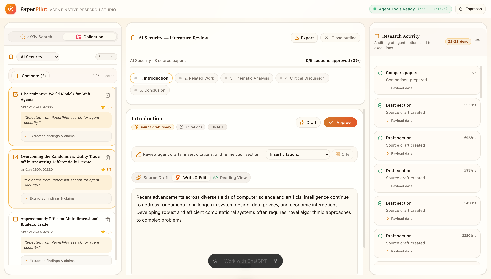
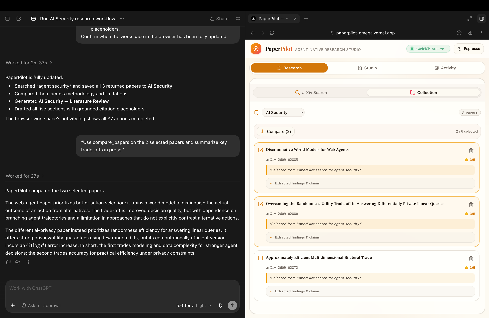
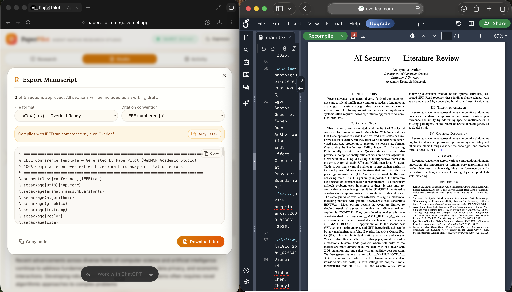
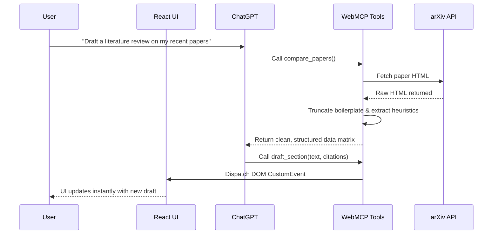

<div align="center">
  # PaperPilot
  **The Agent-Native Academic Research Studio**

  
  
  
  
  

  <br />

  *PaperPilot transforms academic research and literature review writing into a seamlessly synchronized human-agent collaboration. Built for the OpenAI WebMCP Challenge.*

  [Live Demo](#) • [Devpost Submission](#) • [Watch Video](#)
</div>

---

## The Vision

PaperPilot is not just another wrapper around an LLM. It is an **Agent-Native System** designed specifically for academic researchers. By integrating **WebMCP**, PaperPilot exposes 11 strictly typed tools directly to ChatGPT in your browser. 

Instead of copying and pasting abstract after abstract, you simply ask ChatGPT to *"Compare the methodology of the last three papers I added and draft a literature review section."* PaperPilot's robust engine securely extracts the text, builds the comparison matrix, and syncs the drafted manuscript to your UI in real-time.

---

## UI Showcase

<div align="center">
  <!-- Replace these placeholder paths with actual screenshots of your app -->
  
  <br>
  <em>The sleek, responsive dashboard showing your research collections.</em>
</div>

<br>

<div align="center">
  
  <br>
  <em>ChatGPT autonomously utilizing PaperPilot's WebMCP tools to draft and compare sections.</em>
</div>

<br>

<div align="center">
  
  <br>
  <em>The production-ready LaTeX export panel generating 100% compilable Overleaf code.</em>
</div>

---

## Core Features & Technical Highlights

### WebMCP Agent Collaboration
Exposes 11 specialized tools to the browser's native LLM. Features a "Zero Backend" architecture—all tools execute via pure async actions in `src/actions/` and synchronize the React UI instantly using DOM CustomEvents.

### Production-Grade Heuristic Extraction
We don't just dump raw HTML into the agent's context window. Our bulletproof full-text pipeline:
- Aggressively truncates academic boilerplate (References, Appendices, Acknowledgements) based on LaTeX classes.
- Uses grammar-aware regex `(?<=[a-z]{3,}[.!?])` to flawlessly parse sentences, entirely bypassing abbreviations like `e.g.` and `et al.`

#### Proof of Reliability: The 20-Paper Stress Test

To prove our extraction heuristics aren't just "demo-ware", we ran an automated stress test across 20 highly diverse, seminal AI papers (including *Attention Is All You Need*, *ResNet*, *ViT*, and *Mistral 7B*). 

**Results:** Zero truncation errors and highly accurate heuristic extraction across all 20 tested papers, successfully isolating the Methodology, Key Claims, Limitations, and Conclusion without capturing boilerplate references. [Read the full methodology and extraction logs here](./docs/extraction-test.md).

### Overleaf-Ready Compilable LaTeX Export
Generates flawless LaTeX `.tex` files that compile cleanly on the first try.
- **Smart Math Mode Detection:** Preserves intentional inline math blocks (`$O(\log d)$`) generated by ChatGPT.
- **Safe Escaping:** Neutralizes all rogue LaTeX reserved characters (`_`, `%`, `&`) without breaking math syntax.
- **Automated Citations:** Securely injects `\cite{}` markers natively linked to a dynamically generated `\bibitem` bibliography.

---

## Architecture

- **One Implementation, Two Callers:** Pure async actions called identically by the React UI and WebMCP tools.
- **WebMCP Tool Registration:** 13 tools registered via `useWebMCP` hook with Zod validation.
- **Instant Reactive Sync:** DOM CustomEvents (`paperpilot:collections-changed`, `paperpilot:outlines-changed`) update React state in real-time without polling.
- **Zero Backend:** Direct arXiv API fetch with browser-native `DOMParser` + `localStorage` persistence.

### Data Flow



---

## WebMCP Tool Catalog (13 Tools)

1. `search_papers` *(read-only)* — Search arXiv for papers
2. `extract_findings` *(read-only)* — Extract research question, claims, methodology, limitations
3. `find_evidence` *(read-only)* — Retrieve most relevant quoted sentences from a paper's full text for a query
4. `compare_papers` *(read-only)* — Structured matrix comparing 2-5 papers
5. `find_related` *(read-only)* — Find semantic neighbors within collection
6. `add_to_collection` *(mutation)* — Save paper with annotation and rating
7. `get_collection` *(read-only)* — Retrieve collection by ID
8. `generate_outline` *(mutation)* — Generate outline for literature review, research article, or thesis chapter
9. `draft_section` *(mutation)* — Draft section using collection papers and citation placeholders
10. `revise_section` *(mutation)* — Save an updated, human-AI composed draft of a section
11. `insert_citation` *(mutation)* — Insert formatted APA citation into draft
12. `verify_claim` *(read-only)* — Verify claim against source findings via keyword matching
13. `suggest_transition` *(read-only)* — Suggest bridge sentence between sections

---

## Getting Started

### Prerequisites
- Node.js 18+
- A WebMCP-enabled browser environment (e.g., Google Chrome 149+ with `chrome://flags/#enable-webmcp-testing` or the ChatGPT Desktop App).

### Installation

1. Clone the repository:
   ```bash
   git clone https://github.com/your-username/paperpilot.git
   cd paperpilot
   ```

2. Install dependencies:
   ```bash
   npm install
   ```

3. Run the development server:
   ```bash
   npm run dev
   ```

4. Open [http://localhost:3000](http://localhost:3000) and watch the agent take over!

---

## License

This project is licensed under the MIT License.
